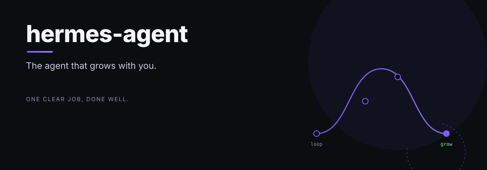

# hermes-agent

<p align="center">

</p>

hermes-agent - The agent that grows with you

> One clear job, done well.

## Quick Install

### Linux, macOS, WSL2, Termux

```bash
curl -fsSL https://hermes-agent.nousresearch.com/install.sh | bash
```

### Windows (native, PowerShell)

Native Windows runs Hermes without WSL — CLI, gateway, TUI, and tools all work
natively. The Windows installer is [`scripts/install.ps1`](scripts/install.ps1);
run this in PowerShell:

```powershell
iex (irm https://hermes-agent.nousresearch.com/install.ps1)
```

It handles uv, Python 3.11, Node.js, ripgrep, ffmpeg, and a portable Git Bash
(MinGit, unpacked to `%LOCALAPPDATA%\hermes\git` — no admin required, isolated
from any system Git install). Found a bug? Please [file issues](https://github.com/NousResearch/hermes-agent/issues).

After installation:

```bash
source ~/.bashrc    # reload shell (or: source ~/.zshrc)
hermes              # start chatting!
```

---

*hermes-agent is part of the [OCAS Agent Suite](https://github.com/indigokarasu).*
---
## 📄 License
MIT License — see `LICENSE` for details.
